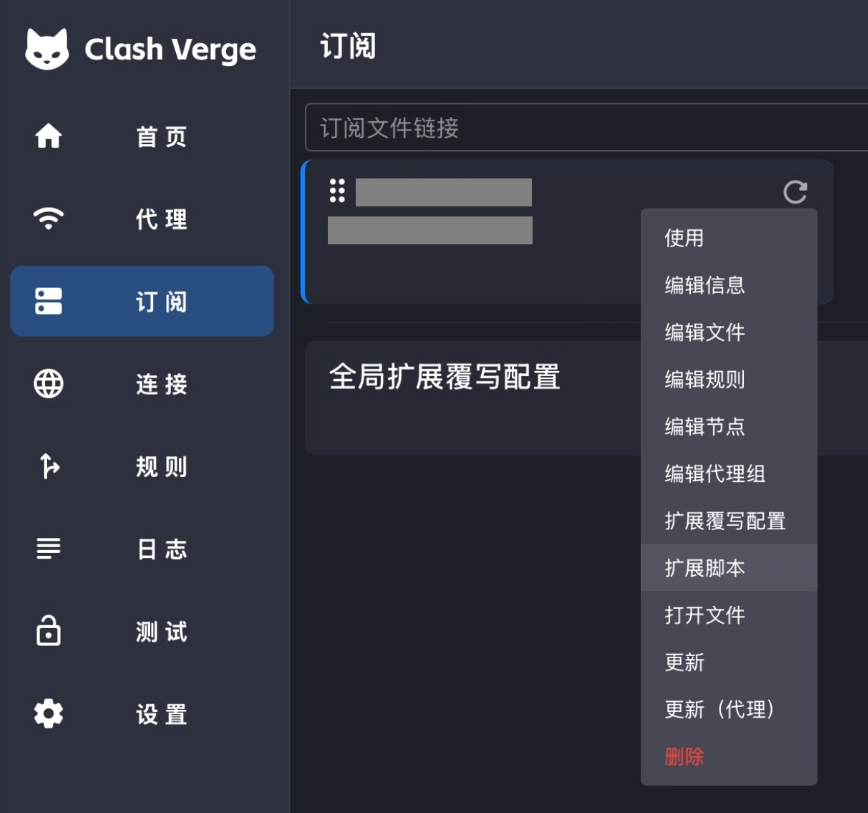

# Clash Verge Rev Loyalsoldier Rules Extension

自建节点适用：
一个用于 Clash Verge Rev / Mihomo 的扩展脚本示例，用于在不修改原始订阅的前提下，叠加使用 [Loyalsoldier/clash-rules](https://github.com/Loyalsoldier/clash-rules) 规则集。

本项目适合以下场景：

- 已经在 Clash Verge Rev 中使用的订阅；
- 不希望直接修改订阅生成的 YAML 配置；
- 希望额外引入 Loyalsoldier 规则集；
- 希望通过 `rule-providers` + 前置规则的方式增强分流能力；
- 希望在订阅更新后仍然保留自己的规则配置。

## 功能说明

该扩展脚本会自动完成以下操作：

1. 创建一个名为 `PROXY` 的代理组；
2. 将当前配置中的可用代理节点加入 `PROXY` 组；
3. 注入 Loyalsoldier 的公共规则集；
4. 将自定义规则插入到原订阅规则之前；
5. 避免重复插入 `ls-*` 规则；
6. 未匹配到自定义规则的流量继续走原订阅规则。

## 隐私说明

本项目不包含任何个人节点、机场订阅、账号密钥、订阅 URL 或私有服务器信息。

请注意：

- 可以公开分享本扩展脚本；
- 不建议公开分享 Clash Verge Rev 最终生成后的完整配置；
- 不要将自己的机场订阅链接、节点服务器地址、认证信息、Token、Cookie、API Key 提交到 GitHub；
- 如果你在脚本中自行添加了私有订阅地址或私有规则地址，请在公开前删除。

## 使用环境

适用于：

- macOS
- Clash Verge Rev
- Mihomo / Clash Meta 内核
- 支持 `rule-providers` 的 Clash 配置

## 使用方法

### 1. 打开 Clash Verge Rev

进入 Clash Verge Rev 的配置页面。

### 2. 找到当前正在使用的订阅配置

在订阅配置卡片上右键，选择：

```text
扩展脚本
```



粘贴 'extension-script.js' 的内容。
Job done.
